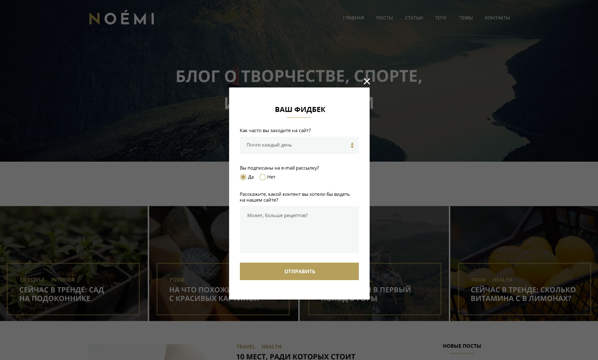

# Дипломный проект курса «Адаптивная и мобильная верстка»

В рамках дипломного проекта свёрстан макет сайта для двух групп устройств: десктопные экраны и планшеты.

Макеты сайта для различных экранов выглядят так:

Исходные файлы макетов хранятся в директории [sources](./sources/) репозитория:

- `NOEMI_mq_desktop.psd` – макет для экрана шириной 1200px и более,
- `NOEMI_mq_tablet.psd` – макет для экрана шириной 768px.

О верстке промежуточных состояний подробнее читайте в разделе [Промежуточные состояния между макетами](#Промежуточные-состояния-между-макетами).

Также папка [sources](./sources/) содержит jpg-изображения – превью макетов для быстрого просмотра.

В директории [fonts](./fonts/) можно найти использующиеся в макете шрифты, а в директории [svg](./sources/svg/) — иконки в формате `svg`.

### Кроссбраузерная вёрстка
В рамках проекта свёрстанные макеты корректно отображаются на следующих типах устройств:
- компьютерах с операционными системами Windows и Mac OS,
- планшетах с операционной системой iOS,
- планшетах с операционной системой Android.

Кроме поддержки основных типов устройств вёрстка также корректно работает в следующих браузерах:
- Последняя версия Google Chrome,
- Последняя версия Mozilla FireFox,
- Последняя версия Edge,
- Последняя версия Opera,
- Последняя версия Safari,
- Последняя версия Mobile Safari,
- Последняя версия Mobile Chrome.

### Промежуточные состояния между макетами
Дизайнер подготовил 2 макета отображения страницы для устройств с шириной экрана 768px и 1200px. Но дизайнер не предоставил отображения страницы в промежуточных состояниях, поэтому они реализованы с помощью принципа «Резиновая вёрстка».

Таким образом, на экранах с шириной больше 1200px фоновые блоки растягиваются на всю ширину экрана, а их контент центрируется.

На устройствах с шириной экрана от 1200px и более реализован дизайн макета `NOEMI_mq_desktop.psd`.

Для устройств с шириной экрана, попадающей в диапазон от 641px до 1200px, реализован резиновый дизайн макета `NOEMI_mq_tablet.psd`.

### Состояния при повороте экрана
Вёрстка раздела «Сейчас в тренде» отличается при портретной (вертикальной) ориентации экрана и при пейзажной (горизонтальной).

Для устройств с шириной экрана, попадающей в диапазон от 641px до 1200px, при портретной ориентации экрана карточки трендов выстроены в две колонки, а при пейзажной ориентации — в четыре.

### Вёрстка всплывающей формы (попап)
Каждый макет содержит всплывающую форму на слое `Popup`, этот слой по умолчанию скрыт. Свёрстанная форма отображается по центру экрана, поверх вуали, затемняющей страницу. 

### Вёрстка бургер-меню
В зависимости от макета, видима либо иконка, либо меню.

### Семантическое использование тегов
В макетах проекта содержатся следующие элементы:
- Разделы,
- Заголовки,
- Ссылки,
- Изображения,
- Подписи,
- Абзацы.

Все эти элементы имеют специальные теги в стандарте HTML5

### Семантические названия атрибутов
Кроме использования семантических тегов также заданы семантические названия на английском языке в качестве значений атрибутов.

### Реализация сетки
Сетка страницы реализована при помощи `flexbox`.

### Добавление меньшего или большего количества контента в блоки
Также протестированы блоки с информацией, добавлено больше или меньше контента, чем представлено в макетах. Блоки не ломают соседние блоки, текст при этом остаётся полностью читаемым.

### Ошибки загрузки изображений
При вёрстке изображений предусмотрена ситуация, когда по какой-либо причине они не загрузятся.

- В случае контентных изображений вместо изображения должен отображается альтернативный текст, из которого становится понятно, что изображено на картинке.

- Для декоративных изображений подобраны подложки для текста, чтобы текст был читаемым в любой ситуации. 

### Оформление кода
Дипломный проект соответствует принятому стилю кода для [HTML](https://github.com/netology-code/codestyle/tree/master/html) и [CSS](https://github.com/netology-code/codestyle/tree/master/css).

### Файловая структура проекта
Файловая структура проекта состоит из следующих элементов:
- `css` — папка, содержащая стили проекта,
- `fonts` — папка, содержащая шрифты проекта,
- `images` — папка, содержащая графику проекта,
- `sources` — папка, содержащая исходные файлы макетов сайта,
- `svg` - папка, содержащая иконки в формате SVG,
- `index.html` — HTML-страница.

Файла проекта соответствуют [правилам именования файлов](https://github.com/netology-code/codestyle/tree/master/naming).  

### Публикация проекта
При разработке проекта и для итоговой демонстрации использован сервис GitHub Pages.